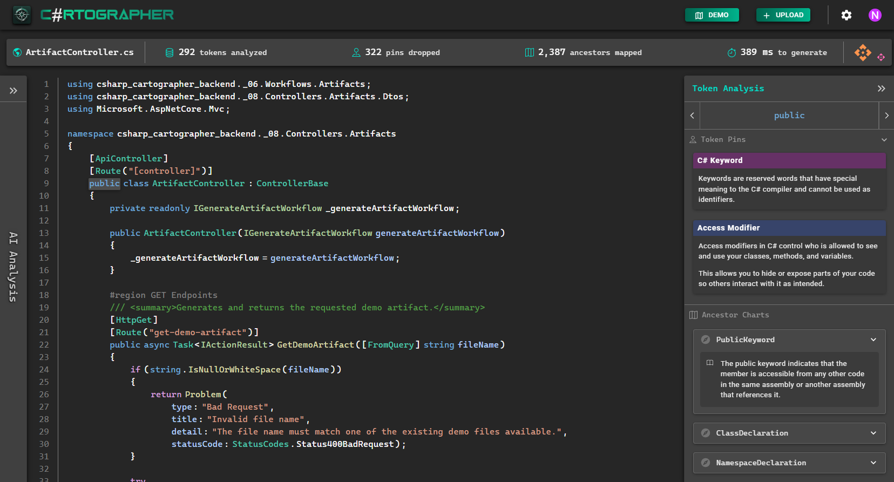

# C# CARTOGRAPHER

An interactive C# code analysis tool that tokenizes source files using Microsoft's Roslyn library and enriches each token with classification, semantic context, and navigational metadata to help developers understand code at any level.



## Why This Exists

Jumping into an enterprise codebase at the junior level can feel overwhelming at times. The idea behind this project was to give developers a way to explore C# at the most fundamental level in hopes of building a better understanding of the language.

This project works by:

- Breaking down C# source code into individual Roslyn tokens
- Attaching semantic meaning to each token (keywords, identifiers, literals, operators, etc.)
- Providing navigational and educational context
- Enabling interactive exploration of code at any level

This tool can be beneficial for learning, onboarding, debugging, and documentation.

## Features

- Roslyn-based tokenization of C# source files
- Token classification (keywords, identifiers, literals, operators, punctuation, etc.)
- SemanticModel integration for symbol and type awareness
- Syntax highlighting to make exploration easier
- Token ancestry mapping & highlighting

## Running the Project

This project consists of a frontend web app written in React and a backend API written in C#.
Both must be running for full functionality.

### Prerequisites (Frontend)
- Node.js 20+ (LTS recommended)

### Prerequisites (Backend)
- .NET 8 SDK

### Run (Frontend)

From the frontend directory (the folder containing `package.json`):

```bash
cd csharp-cartographer\csharp-cartographer-frontend
npm install
npm start
```

### Run (Backend)

From the backend project directory (the folder containing the `.csproj` file):

```bash
cd csharp-cartographer\csharp-cartographer-backend\csharp-cartographer-backend
dotnet run
```
